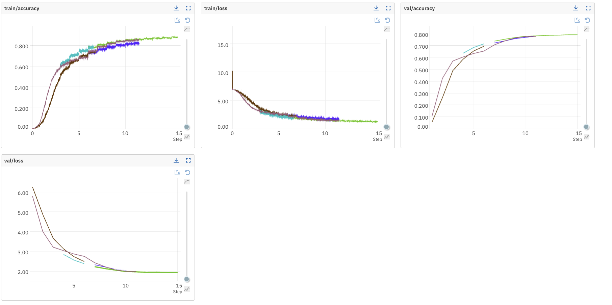
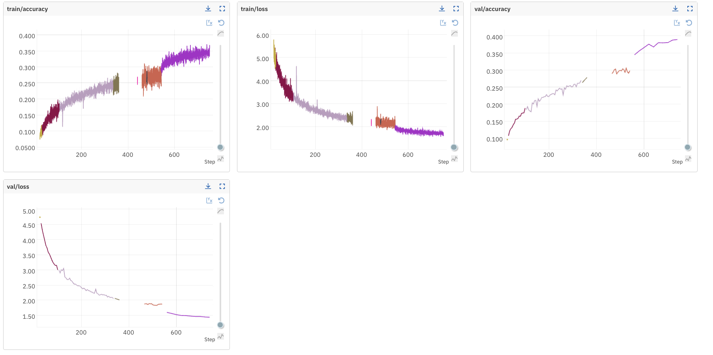

# Rishi's YOLO v1 implementation (including pretraining)

YOLO finetuning


YOLO pretraining


## About and results

I pretrain YOLO on ImageNet and then finetune it on Pascal VOC. The code may contain some inaccuracies but it achieves 39% correct as compared to YOLO's 65% correct.

Note: After finishing work for this project, I realized that the YOLO guys applied NMS before calculating accuracy whereas I only applied it for visualization. As a result, there are a lot more false positives and hence, my accuracy figures below have been understated.

### Pretraining YOLO

The YOLO network used 22.4M parameters and trained on 1 RTX 4090 image net for <5 hours (i think). I achieved 79.5% classification top-5 accuracy.

YOLO pretraining overview curves:


### Finetuning YOLO

The YOLO network used 272M parameters and trained on two RTX 4090s for <2 days. I trained my model for 740 epochs and achieved 39% test set accuracy. The YOLO folks trained their model for 135 epochs and achieved 65% accuracy.

YOLO finetuning overview curves:


### Potential improvements

The YOLO guys pretrained their model on ImageNet until they hit 88% top-5 accuracy. I only pretrained it until 79.5% top-5 accuracy. With more hyperparameter search, I could have gotten there.

However, when finetuning YOLO, the YOLO guys hit 65% accuracy with 135 epochs whereas I only hit 39% after 740 epochs of training. Part of this was because my pretrained model wasn't as good as theirs; however, more importantly, my YOLO loss function didn't normalize by the number of objects. I tried slowly increasing the learning rate from 0.0001 to 0.001 but then the losses exploded. By the time I realized this, I had a model that was slowly improving and I was exhausted with all the coding, so I didn't fix what wasn't broken. However, if i had divided my loss by say #images in batch and #objects in image and cranked up my learning rate to 0.001, the network could have trained faster and better.

## Installing and running this project

Install requirements with

```
pip install -r requirements.txt
pip install -r requirements-dev.txt
```

Create a `config.yaml` file under `scripts` with 

```
image_net_data_dir: <path to image net dir>. # (This folder should contain the files/folders (ILSVRC2012_devkit_t12.tar.gz, ILSVRC2012_img_train.tar
pascal_voc_root_dir: <path to directory storing pascal voc dataset>. # (This folder should contain the files/folders VOCdevkit, VOCtrainval_11-May-2012.tar
```

YOLO pretraining inference:

Download the checkpoint from [here](https://drive.google.com/file/d/1tlUXxBP7nR5PrwyugNWjf3kwYwBEkmjn/view?usp=drive_link) and place it at `scripts/checkpoints/IM-122/epoch_14.pth`. Weird location? I know. Then run the command below:

```
python visualize_image_net.py --checkpoint_signature=IM-122:checkpoints/epoch_14
```

YOLO Inference:
Download the checkpoint from [here](https://drive.google.com/file/d/1g9CWFUSGlNvo6ig5U3dRiWYJVAuXl20O/view?usp=sharing) and place it at `scripts/checkpoints/IM-272/epoch_740.pth`.

```
python visualize_pascal_voc.py --checkpoint_signature IM-272:checkpoints/epoch_740 --threshold 0.25 --seed 10022 --show_preds true --apply_nms true --nms_iou_threshold 0.5
```

Pretraining:

```
python pretrain_yolo.py --num_epochs 10 --batch_size 4 --lr_scheduler custom --lr 0.001 --dropout 0 --run_name cpu_run_on_image_net
```

Finetuning:

```
python train_yolo.py --num_epochs 10 --batch_size 512 --lr_scheduler fixed --lr 0.001 --dropout 0 --run_name yolo_finetune --continue_from_image_net_checkpoint_signature IM-122:checkpoints/epoch_14
```

or

```
python train_yolo.py --run_name cont_yolo_with_data_augmentation_0.0001_with_8_threads --continue_from_yolo_checkpoint_signature IM-249:checkpoints/epoch_25 --num_epochs 135 --batch_size 64 --lr_scheduler fixed --lr 0.0001 --dropout 0.5 --device cuda --checkpoint_interval 5
```

Testing:

```
cd tests
pytest
```

### More YOLO predictions

YOLO finetuning:


YOLO pretraining:


### All YOLO finetuning training curves


## Credits

Thanks to [neptune.ai](https://neptune.ai) for letting me use their experiment tracking tool for free. I would highly recommend it.

## References

[YOLO v1 paper](https://arxiv.org/pdf/1506.02640)
